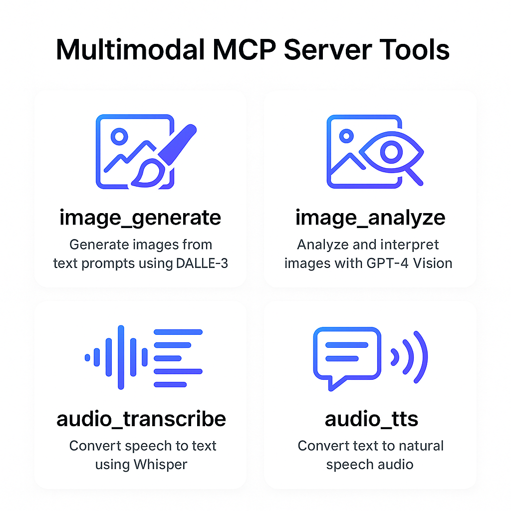

# Multimodal MCP Server

[](https://www.python.org/)
[](https://platform.openai.com/)
[](https://gofastmcp.com/getting-started/welcome)
[](LICENSE)
[](FOSS_PLURALISM_MANIFESTO.md)

A production-ready Model Context Protocol (MCP) server that brings OpenAI's multimodal capabilities—vision, image generation, speech-to-text, and text-to-speech—to any MCP-compatible client. Built with a file-first architecture for security and transparency, ensuring all operations use explicit input/output paths.

## Features

Multimodal MCP server exposing file-oriented tools backed by the OpenAI API:

- `image_generate` - create an image from a prompt and write it to a client-specified destination.
- `image_analyze` - interpret an image and return text or schema-validated JSON.
- `image_edit` - edit or inpaint an image using a prompt and optional mask.
- `image_extract` - extract structured JSON from images with schema enforcement.
- `image_to_spec` - convert diagrams or UI into structured specs (Mermaid, OpenAPI, etc.).
- `audio_transcribe` - transcribe audio to text (optionally write transcript to a file).
- `audio_analyze` - analyze audio content and return text or schema-validated JSON.
- `audio_transform` - transform speech-to-speech based on an instruction.
- `audio_tts` - generate speech audio from text and write it to a client-specified destination.
- `multimodal_chain` - execute a deterministic, explicit sequence of multimodal steps.

The server is file-first: it only reads from explicit input paths/URLs and writes to explicit output paths/URLs.


> the image was created by the MCP server

[Audio description of the project](https://raw.githubusercontent.com/soyrochus/m3cp/main/mcp-tools.mp3)
> the audio file was created by the MCP server

For detailed tool semantics and client usage patterns, see [docs/m3cp-manual.md](docs/m3cp-manual.md).

## Run Locally

```bash
python -m multimodal_mcp.main
```

Or via the console script (after installing with `uv sync`):

```bash
mcp-multimodal-server
```

## Running Tests

Install the package with dev dependencies:

```bash
uv sync

```

Run all tests:

```bash
uv run pytest
```

Run tests with coverage:

```bash
uv run pytest --cov=multimodal_mcp
```

### Live Integration Tests

Live integration tests make actual API calls to OpenAI and are disabled by default. To run them:

```bash
RUN_LIVE_TESTS=1 uv run pytest
```

**Note:** Live tests require:
- Valid `OPENAI_API_KEY` in your `.env` file
- Configured model environment variables (`OPENAI_MODEL_VISION`, etc.)
- Will consume OpenAI API credits

## MCP Configuration (mcp.json)

Add the server to your MCP client's configuration. For Claude Desktop or other MCP-compatible clients, add to your `.vscode/mcp.json`:

```json
{
  "servers": {
    "multimodal_mcp": {
      "type": "stdio",
      "command": "uv",
      "args": ["--directory", "${workspaceFolder}", "run", "multimodal_mcp_server.py"]
    }
  },
  "inputs": []
}
```

Or if you've installed the package and want to use the console script:

```json
{
  "servers": {
    "multimodal_mcp": {
      "type": "stdio",
      "command": "mcp-multimodal-server"
    }
  },
  "inputs": []
}
```

**Note:** The server will automatically load the `OPENAI_API_KEY` from the `.env` file in the workspace directory. Make sure your `.env` file contains:

```bash
OPENAI_API_KEY=your-openai-api-key
```

You can also override other environment variables in the `env` object if needed (e.g., `OPENAI_BASE_URL`, `ENABLE_REMOTE_URLS`, etc.).

## Environment Variables

Required:

- `OPENAI_API_KEY`

Optional configuration:

- `OPENAI_BASE_URL`
- `OPENAI_ORG_ID`
- `OPENAI_PROJECT`
- `OPENAI_MODEL_VISION`
- `OPENAI_MODEL_IMAGE`
- `OPENAI_MODEL_IMAGE_EDIT`
- `OPENAI_MODEL_STT`
- `OPENAI_MODEL_TTS`
- `OPENAI_MODEL_AUDIO_ANALYZE`
- `OPENAI_MODEL_AUDIO_TRANSFORM`
- `ENABLE_REMOTE_URLS` (default false)
- `ENABLE_PRESIGNED_UPLOADS` (default false)
- `ALLOW_INSECURE_HTTP` (default false)
- `ALLOW_MKDIR` (default false)
- `MAX_INPUT_BYTES` (default 25MB)
- `MAX_OUTPUT_BYTES` (default 25MB)
- `LOG_LEVEL` (default INFO)
- `MCP_TEMP_DIR` (default system temp dir)

Note: If the model environment variables are not set, pass a `model` override in the tool call.
The server loads a local `.env` file automatically if present.

## Example MCP Tool Calls (Pseudo-code)

```python
# image_generate
client.call_tool(
    "image_generate",
    {
        "prompt": "A watercolor map of a coastal city",
        "output_ref": "/tmp/city.png",
        "size": "1024x1024",
        "format": "png",
        "overwrite": True,
    },
)

# image_analyze
client.call_tool(
    "image_analyze",
    {
        "image_ref": "/tmp/city.png",
        "instruction": "Summarize the visual style",
        "response_format": "text",
    },
)

# image_edit
client.call_tool(
    "image_edit",
    {
        "image_ref": "/tmp/city.png",
        "prompt": "Add a subtle fog layer",
        "output_ref": "/tmp/city-edited.png",
        "overwrite": True,
    },
)

# image_extract
client.call_tool(
    "image_extract",
    {
        "image_ref": "/tmp/form.png",
        "instruction": "Extract form fields",
        "json_schema": {"type": "object", "properties": {"name": {"type": "string"}}},
    },
)

# image_to_spec
client.call_tool(
    "image_to_spec",
    {
        "image_ref": "/tmp/diagram.png",
        "target_format": "mermaid",
        "output_ref": "/tmp/diagram.mmd",
        "overwrite": True,
    },
)

# audio_transcribe
client.call_tool(
    "audio_transcribe",
    {
        "audio_ref": "/tmp/meeting.wav",
        "timestamps": True,
        "output_ref": "/tmp/meeting.txt",
        "overwrite": True,
    },
)

# audio_analyze
client.call_tool(
    "audio_analyze",
    {
        "audio_ref": "/tmp/meeting.wav",
        "instruction": "Summarize tone and speaker dynamics",
        "response_format": "text",
    },
)

# audio_transform
client.call_tool(
    "audio_transform",
    {
        "audio_ref": "/tmp/meeting.wav",
        "instruction": "Translate to Spanish and keep a calm tone",
        "output_ref": "/tmp/meeting-es.mp3",
        "overwrite": True,
    },
)

# audio_tts
client.call_tool(
    "audio_tts",
    {
        "text": "Welcome to the demo!",
        "output_ref": "/tmp/welcome.mp3",
        "format": "mp3",
        "overwrite": True,
    },
)

# multimodal_chain
client.call_tool(
    "multimodal_chain",
    {
        "steps": [
            {
                "tool": "image_analyze",
                "args": {
                    "image_ref": "/tmp/diagram.png",
                    "instruction": "Summarize the architecture",
                },
                "outputs_as": "analysis",
            },
            {
                "tool": "audio_tts",
                "args": {
                    "text": {"$ref": "analysis.metadata.text"},
                    "output_ref": "/tmp/summary.mp3",
                    "overwrite": True,
                },
            },
        ]
    },
)
```

## Security Notes

- The server only reads inputs explicitly provided by the client.
- Remote URLs are disabled unless `ENABLE_REMOTE_URLS=true`.
- Presigned uploads are disabled unless `ENABLE_PRESIGNED_UPLOADS=true`.
- Output directories are only created when `ALLOW_MKDIR=true`.
- Ensure the server has access only to the files and network locations you intend it to reach.

## Principles of Participation

Everyone is invited and welcome to contribute: open issues, propose pull requests, share ideas, or help improve documentation.  
Participation is open to all, regardless of background or viewpoint.  

This project follows the [FOSS Pluralism Manifesto](./FOSS_PLURALISM_MANIFESTO.md),  
which affirms respect for people, freedom to critique ideas, and space for diverse perspectives.  

## License and Copyright

Copyright (c) 2026, Iwan van der Kleijn

This project is licensed under the MIT License. See the [LICENSE](LICENSE) file for details.
