# Implementation details: 

## Tool Registration in FastMCP

This  chapter explains the design decision for tool registration in the Multimodal MCP Server, specifically regarding the choice between functional registration and decorator-based registration patterns.

## Current Implementation: Functional Registration

The `build_server()` function uses **functional registration** where `mcp.tool()` is called manually to register service methods:

```python
def build_server(
    settings: Optional[Settings] = None,
    client: Optional[OpenAIClientProtocol] = None,
    logger: Optional[logging.Logger] = None,
) -> FastMCP:
    settings = settings or load_settings()
    logger = logger or setup_logging(settings.log_level)
    client = client or OpenAIClient(settings)
    service = ToolService(settings, client, logger)
    mcp = FastMCP("multimodal-mcp")
    
    mcp.tool(
        description="Generate an image from a prompt and write it to the output reference.",
    )(service.image_generate)
    
    mcp.tool(
        description="Analyze an image and return text or schema-validated JSON.",
    )(service.image_analyze)
    
    mcp.tool(
        description="Edit or inpaint an image and write the result to the output reference.",
    )(service.image_edit)
    
    # ... additional tools
    
    return mcp
```

### Advantages of Functional Registration

1. **Dependency Injection**: Clean injection of settings, client, and logger through constructor parameters
2. **Testability**: Easy to create mock services and test different configurations
3. **Flexibility**: Can instantiate multiple server instances with different configurations
4. **Encapsulation**: The `ToolService` class encapsulates shared logic and state
5. **No Global State**: Avoids global mcp instance and related coupling issues

### Disadvantages of Functional Registration

1. **More Verbose**: Requires explicit registration calls for each tool
2. **Separation**: Tool definitions are separated from their registration (though still co-located)
3. **Additional Boilerplate**: Need to create service instance before registration

## Alternative Approach: Decorator-Based Registration

The more common FastMCP pattern would be decorator-based registration:

```python
mcp = FastMCP("multimodal-mcp")

@mcp.tool(description="Generate an image from a prompt and write it to the output reference.")
def image_generate(
    prompt: str,
    output_ref: str,
    size: Optional[str] = None,
    background: Optional[str] = None,
    quality: Optional[str] = None,
    format: Optional[str] = None,
    overwrite: bool = False,
    seed: Optional[int] = None,
    safety: Optional[Dict[str, Any]] = None,
    model: Optional[str] = None,
    output_headers: Optional[Dict[str, str]] = None,
) -> Dict[str, Any]:
    """Generate an image from a prompt and write it to the output reference."""
    request_id = str(uuid.uuid4())
    warnings: List[str] = []
    # ... implementation
    return result

@mcp.tool(description="Analyze an image and return text or schema-validated JSON.")
def image_analyze(
    image_ref: str,
    instruction: str,
    response_format: str = "text",
    json_schema: Optional[Dict[str, Any]] = None,
    max_output_tokens: Optional[int] = None,
    detail: Optional[str] = None,
    language: Optional[str] = None,
    model: Optional[str] = None,
) -> Dict[str, Any]:
    """Analyze an image and return text or schema-validated JSON."""
    # ... implementation
    return result

# ... additional tools
```

### Advantages of Decorator Approach

1. **Concise and Declarative**: More compact syntax with clear intent
2. **Convention**: Follows common Python patterns (Flask, FastAPI, etc.)
3. **Co-location**: Registration is directly at function definition
4. **Less Boilerplate**: No separate registration step needed

### Disadvantages of Decorator Approach

1. **Dependency Management**: Difficult to inject dependencies cleanly
   - Would need global variables or closures for settings, client, logger
   - Makes testing harder (can't easily mock dependencies)
2. **Global State**: The `mcp` instance becomes global
3. **Limited Flexibility**: Harder to create multiple server instances with different configs
4. **Code Duplication**: Shared logic (error handling, logging) must be duplicated or extracted awkwardly

## Comparison: Handling Dependencies

### Functional Registration (Current)
```python
class ToolService:
    def __init__(self, settings: Settings, client: OpenAIClientProtocol, logger: logging.Logger):
        self._settings = settings
        self._client = client
        self._logger = logger
    
    def image_generate(self, ...):
        # Direct access to self._settings, self._client, self._logger
        request_id = self._new_request_id()
        self._log_info("image_generate start", request_id)
        result = self._client.generate_image(...)
```

### Decorator Approach (Alternative)
```python
# Option 1: Global variables (not ideal)
settings = load_settings()
client = OpenAIClient(settings)
logger = setup_logging(settings.log_level)

@mcp.tool(...)
def image_generate(...):
    # Access global settings, client, logger
    result = client.generate_image(...)

# Option 2: Closure (better but still awkward)
def create_tools(settings, client, logger):
    @mcp.tool(...)
    def image_generate(...):
        # Access via closure
        result = client.generate_image(...)
    
    return [image_generate, ...]  # But then what?
```

## Design Decision Rationale

**The functional registration approach is the correct choice for this codebase** because:

1. **Production Quality**: This is a production-grade server requiring clean dependency management
2. **Testability**: Unit tests can inject mock clients and settings easily
3. **Maintainability**: The `ToolService` class provides a clear boundary for shared logic
4. **Configurability**: Different server instances can be created with different configurations
5. **No Compromises**: Avoids compromising code quality for syntactic sugar

## When to Use Each Approach

### Use Functional Registration When:
- You need dependency injection
- Testing is important
- You have shared state or logic across tools
- Multiple configurations or instances are needed
- Building production systems

### Use Decorator Approach When:
- Building simple prototypes or demos
- Tools are completely independent
- No shared dependencies or state
- Convention over configuration is prioritized
- Quick iteration is more important than testability

## Conclusion

While the decorator pattern is more common in framework examples and tutorials, the functional registration pattern used in this codebase is **more appropriate for production systems**. It prioritizes:

- Clean architecture
- Testability
- Maintainability
- Flexibility

over

- Syntactic brevity
- Following common conventions

This is a conscious design choice that reflects software engineering best practices for production services.

---

## Server Architecture 

The Multimodal MCP Server is built using a layered architecture that separates concerns between protocol handling, business logic, external API integration, and I/O operations. This section provides visual representations and explanations of the system architecture.

### Context Diagram (Level 1)

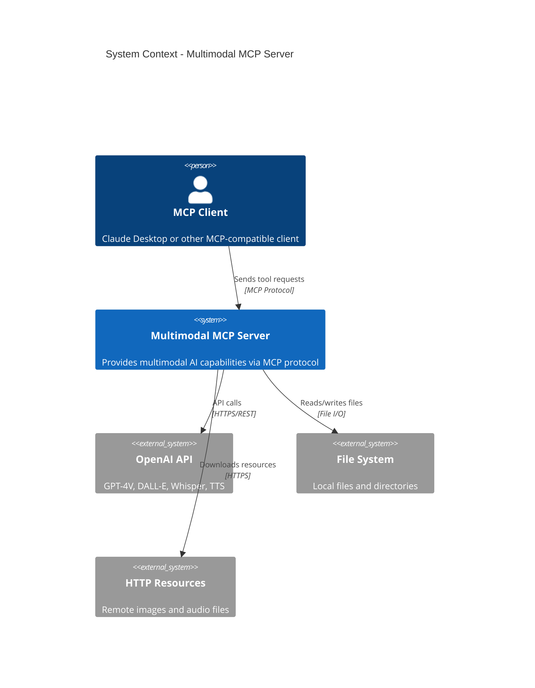

### Container Diagram (Level 2)

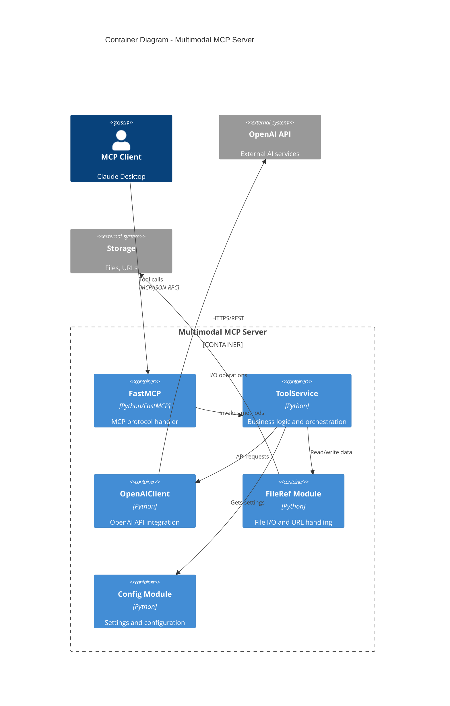

### Component Diagram (Level 3)

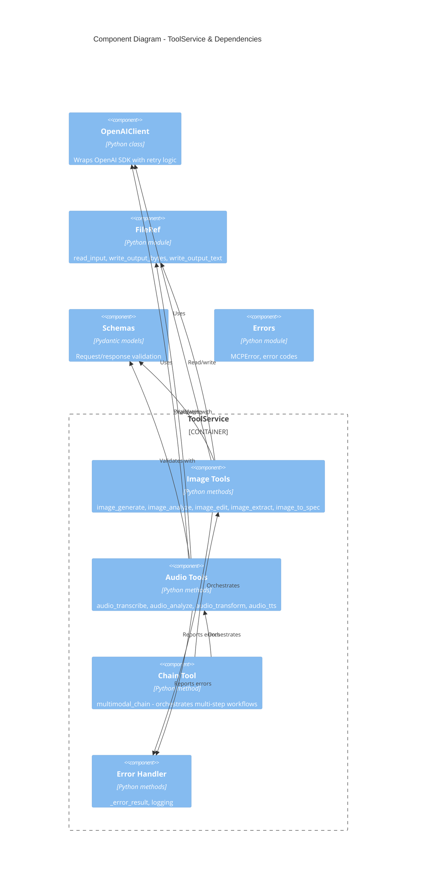

## Class Diagram

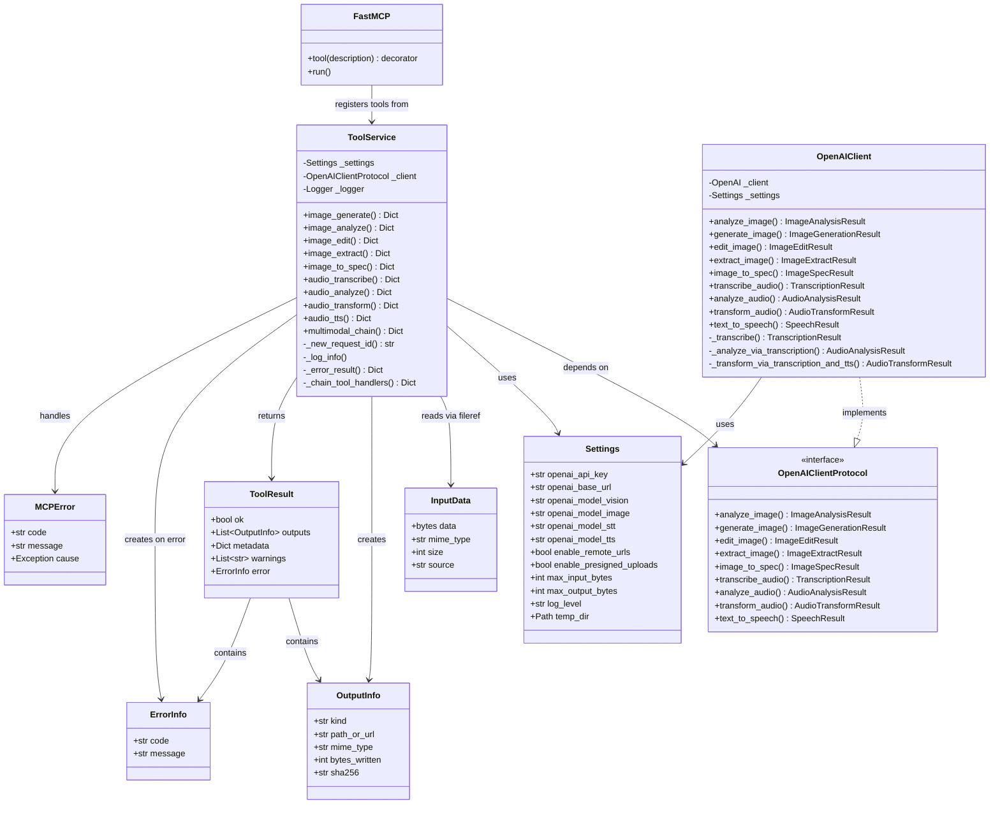

## Architecture Layers

### Layer 1: Protocol Layer (FastMCP)

**Responsibility**: Handle MCP protocol, JSON-RPC communication, tool registration


**Key Characteristics**:
- Handles protocol serialization/deserialization
- Manages tool discovery and invocation
- Translates between MCP protocol and Python method calls

### Layer 2: Service Layer (ToolService)

**Responsibility**: Business logic, validation, orchestration, error handling

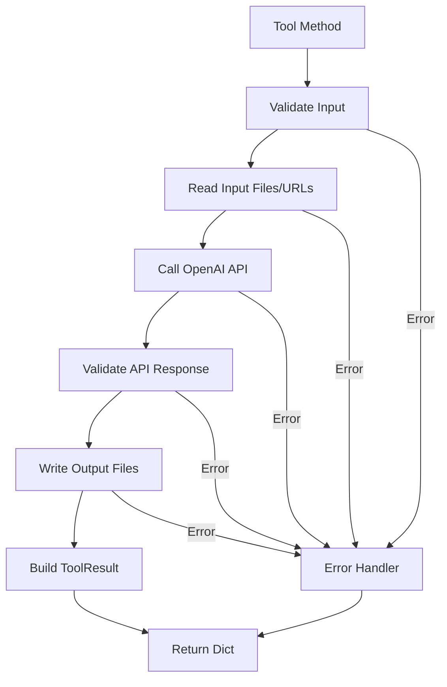

**Key Characteristics**:
- Implements all tool methods (image_generate, audio_transcribe, etc.)
- Validates arguments using Pydantic schemas
- Coordinates between fileref and OpenAI client
- Consistent error handling and logging
- Returns standardized ToolResult dictionaries

### Layer 3: Integration Layer (OpenAIClient)

**Responsibility**: OpenAI API integration, retry logic, response transformation

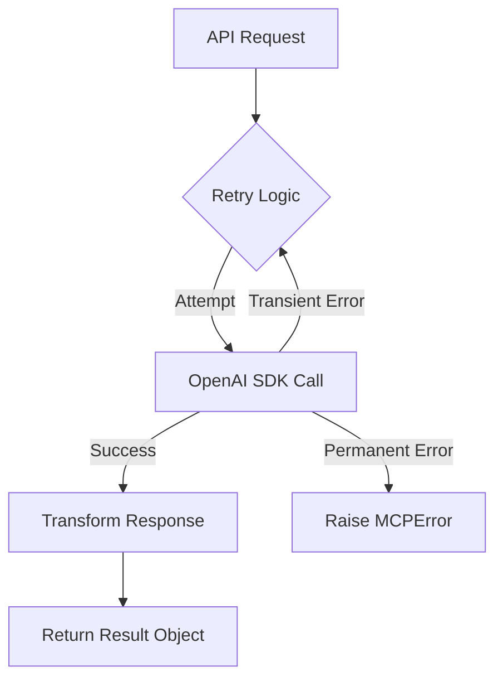

**Key Characteristics**:
- Wraps OpenAI Python SDK
- Implements retry logic with exponential backoff
- Handles rate limits and transient errors
- Transforms OpenAI responses to internal result types
- Supports model overrides and configuration

### Layer 4: I/O Layer (FileRef Module)

**Responsibility**: File and URL I/O, validation, security checks

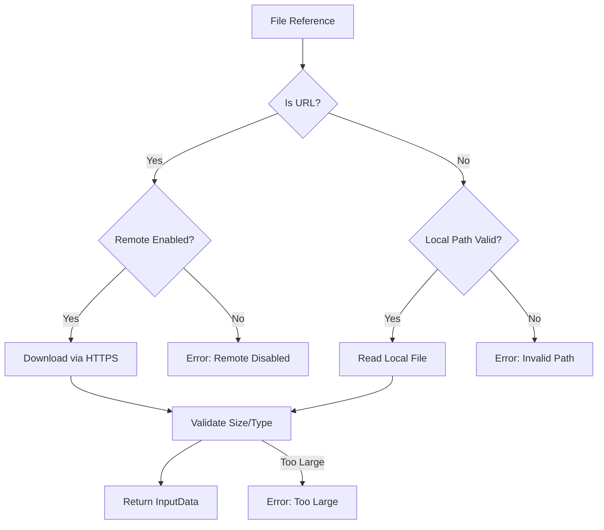

**Key Characteristics**:
- Handles both local files and remote URLs
- Enforces size limits and security policies
- Computes SHA256 hashes for integrity
- Supports presigned URL uploads
- Provides consistent InputData abstraction

## Data Flow: Image Generation Example

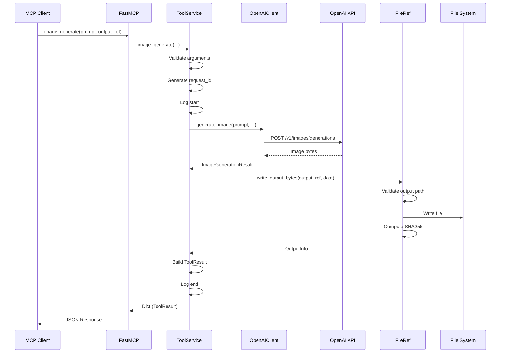

## Data Flow: Multimodal Chain Example

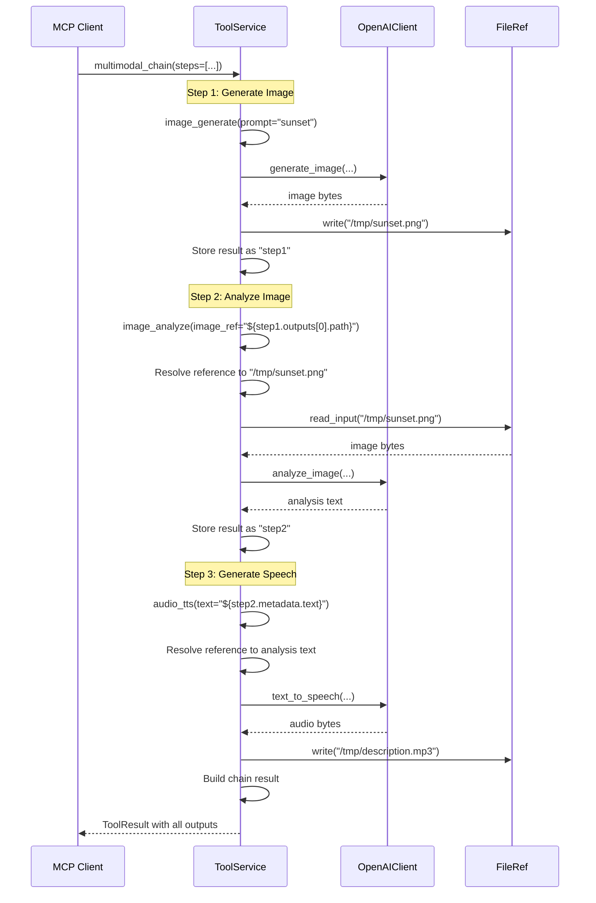

## Error Handling Architecture

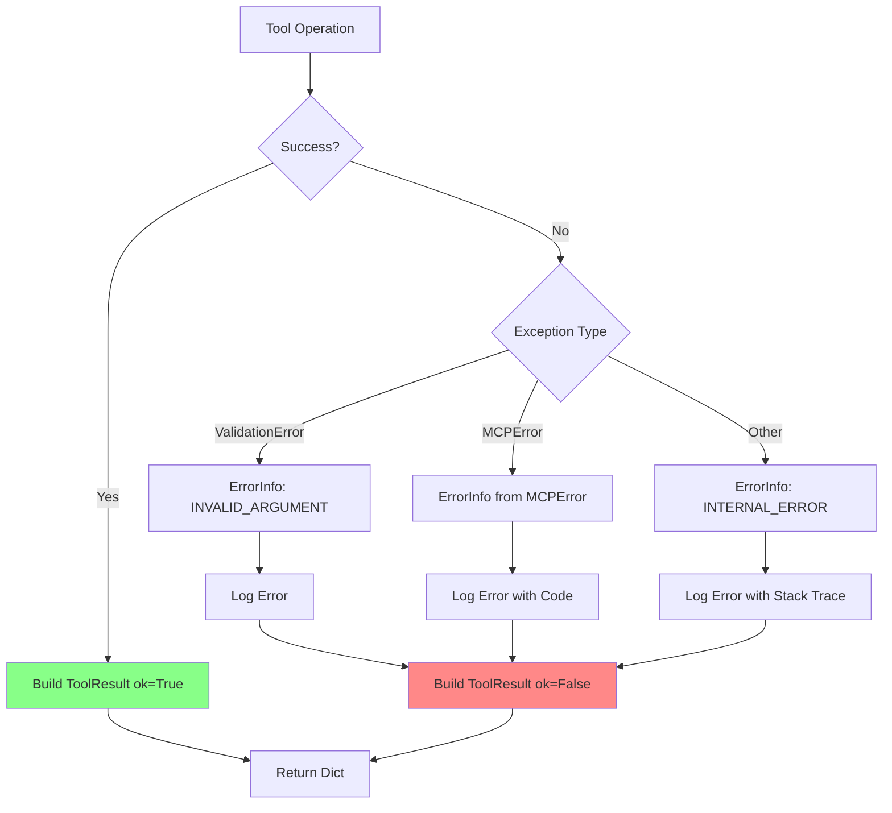

**Error Codes**:
- `INVALID_ARGUMENT`: Validation failures, bad parameters
- `INPUT_NOT_FOUND`: Missing input files
- `INPUT_TOO_LARGE`: Input exceeds size limits
- `OUTPUT_EXISTS`: Output file exists, overwrite not allowed
- `UNSUPPORTED_FORMAT`: Unsupported file format
- `OPENAI_ERROR`: OpenAI API errors
- `SCHEMA_VALIDATION_FAILED`: JSON schema validation failures
- `CHAIN_STEP_FAILED`: Chain step execution failures
- `INTERNAL_ERROR`: Unexpected errors

## Configuration and Dependency Injection

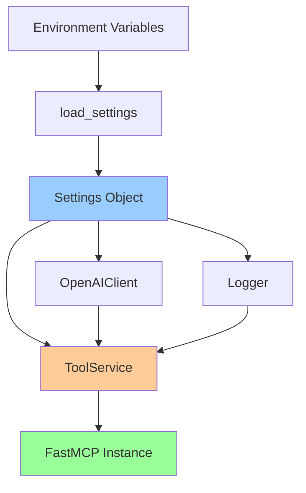

**Settings Sources** (in order of precedence):
1. Environment variables
2. `.env` file
3. Default values

**Injected Dependencies**:
- `Settings`: Configuration object
- `OpenAIClientProtocol`: AI service integration (mockable)
- `Logger`: Structured logging

This architecture enables:
- **Testability**: Mock any dependency
- **Flexibility**: Swap implementations (e.g., different AI providers)
- **Configuration**: Environment-based settings without code changes
- **Separation of Concerns**: Clear boundaries between layers

## Key Design Patterns

### 1. Dependency Injection
All dependencies flow from `build_server()` down through constructor injection, avoiding global state.

### 2. Protocol/Interface Segregation
`OpenAIClientProtocol` defines the interface, allowing mock implementations for testing.

### 3. Error Translation
Low-level exceptions (httpx, OpenAI SDK) are translated to domain-specific `MCPError` instances with meaningful error codes.

### 4. Consistent Result Format
All tools return `ToolResult` dictionaries with consistent structure (ok, outputs, metadata, warnings, error).

### 5. Reference Resolution
The chain tool uses a `$ref` syntax to reference outputs from previous steps, enabling complex workflows.

### 6. Retry with Exponential Backoff
Transient API failures are automatically retried with exponential backoff to improve reliability.

### 7. Security-First I/O
File and URL operations enforce configurable security policies (size limits, path validation, remote access control).
